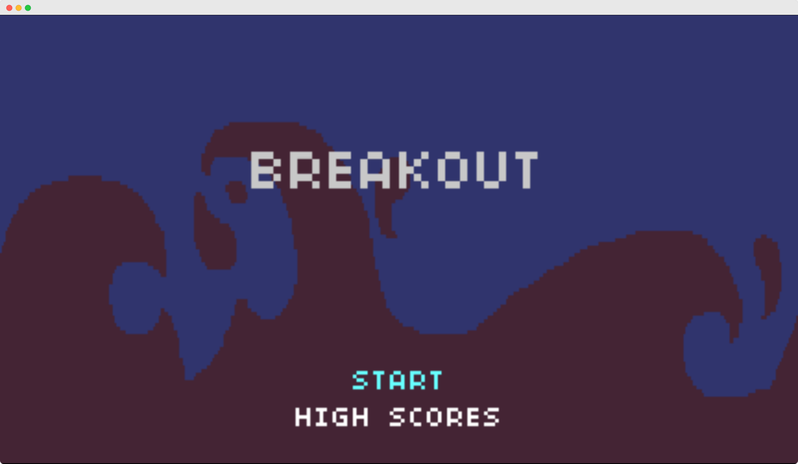
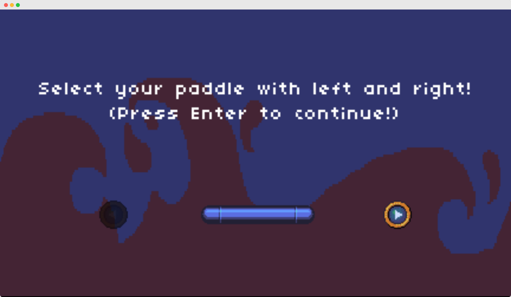
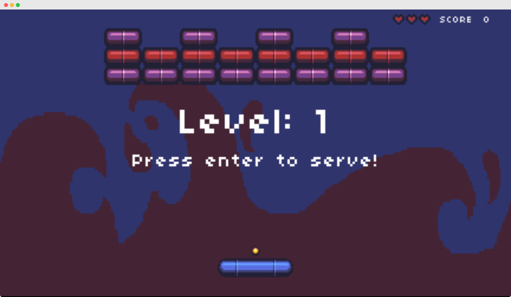
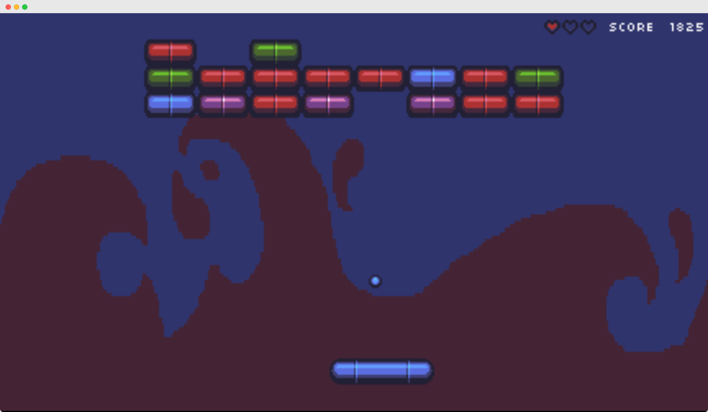
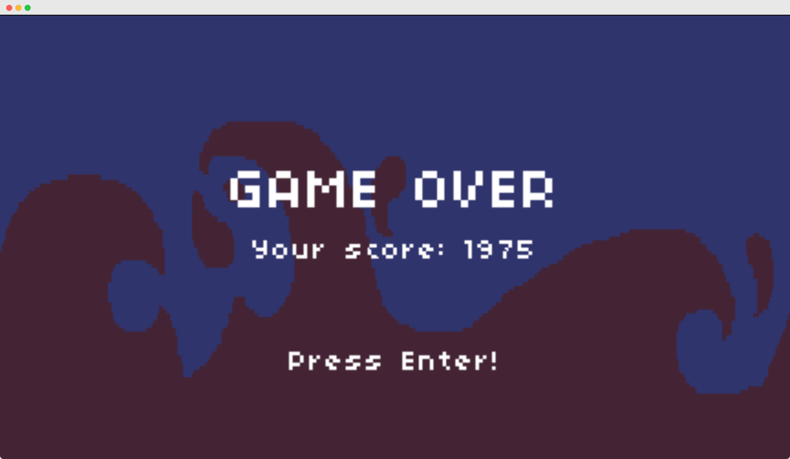
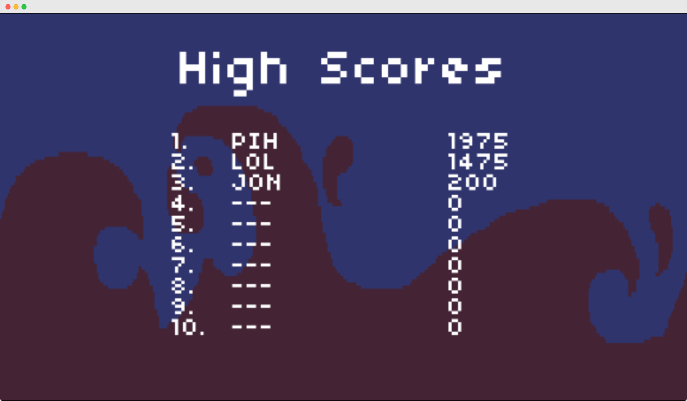

Create a classic and engaging Breakout game using Raylib. This project serves as a comprehensive implementation, offering both local and online play experiences.

# Features:

- Built with Raylib, a versatile game development library
- Authentic Breakout gameplay mechanics
- Visually appealing using assets from CS50 Game Development (https://www.classcentral.com/report/edx-top-courses/)
- User-friendly controls
- WebAssembly (WASM) build for online play
- Hosted online at [https://pixelhat.github.io/breakout-raylib/](https://pixelhat.github.io/breakout-raylib/)

# Getting Started:

- Prerequisites:
    - A C compiler (e.g., GCC, Clang)
    - Basic understanding of C programming
    - Familiarity with game development concepts
- Local Setup:
    - Clone the repository: git clone https://github.com/pixelhat/breakout-raylib.git
    - Build the game:
         - Using Make: make
         - Building WASM: make wasm
    - Run the game: ./game (or the corresponding executable in the dist directory)
- Online Play:
    - Visit: [https://pixelhat.github.io/breakout-raylib/](https://pixelhat.github.io/breakout-raylib/)

# Building the WASM Version:

To build the game for online play via WebAssembly, use the dedicated command:

```sh
make wasm
```

This will create a `dist` directory containing the WebAssembly files and supporting assets.

GitHub Actions:

The repository automatically builds the WASM version on every push to the main branch using GitHub Actions.

# Images:









# Additional Notes:

This project is an individual effort for learning purposes.

Have fun playing Breakout and exploring the code!
